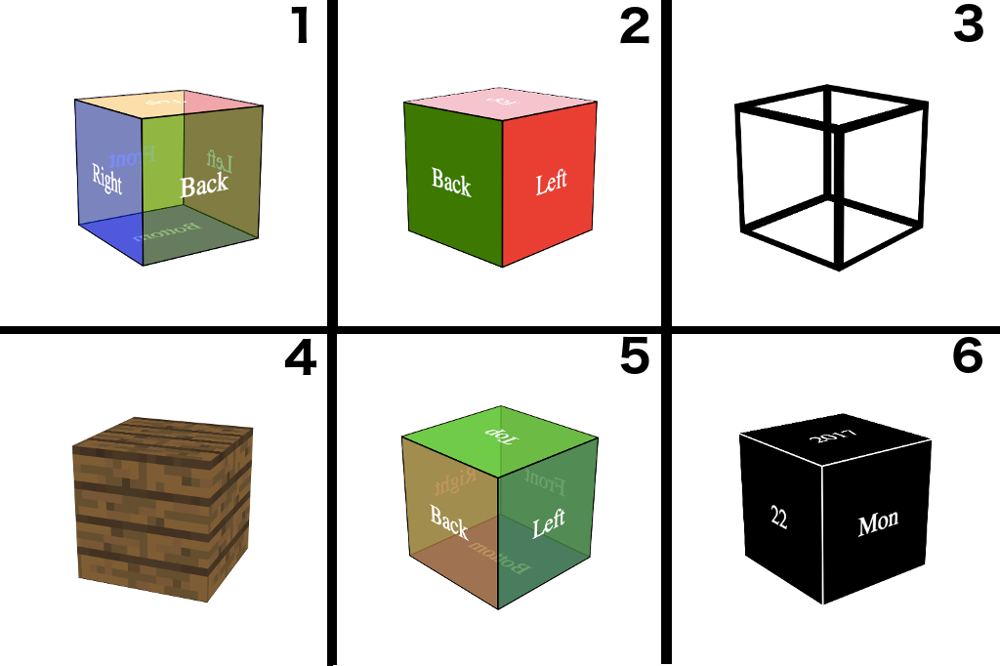

# 3D Cube

A 3d cube to view in browser to toy with. Features user control for cube rotation, zoom in/out, and six modes for the cube.

### Tech Stack

Built using HTML, CSS, and object oriented JavaScript.

### Cube Modes

The cube has six modes the user can alternate between. The first mode is a semi-transparent colored cube and is the default,
mode two is an opaque colored cube, mode three is a wire-frame cube, four is a cube with an image on the faces, five is a semi-transparent color-changing cube, and lastly, six is box with five faces and the date all over it.

### Instructions

To get this working, simply download this repo, and open the index.html in browser.
